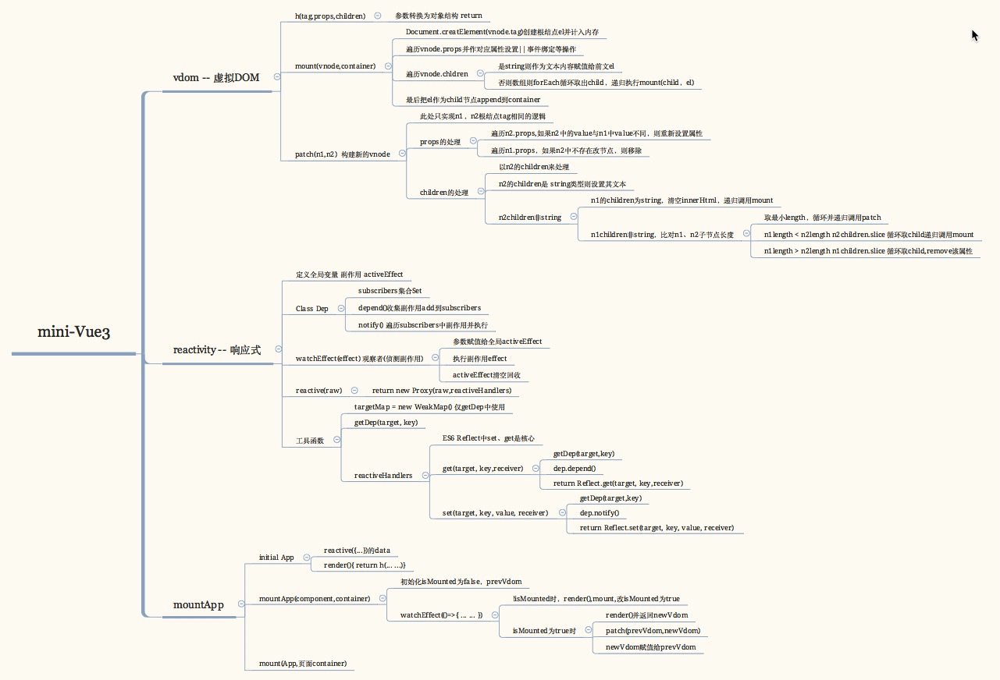

### vue3-mini
* 该目录文件夹中系列为: 原生实现vue3核心模块 Virtual DOM，Deps依赖收集、reactivity、composition API等等
* 您的star将会激发我持续coding和写下去的源源动力，如果有收获，感谢您高抬贵手的star！！！

#### 资源详细描述
+ vdom 虚拟Dom层: mount(挂载)、patch(比对&更新)
    + 虚拟Dom层益处一：彻底解藕组件在真实DOM中的渲染逻辑，让其在非浏览器环境下简单直接的重复使用
        + 三方开发创建定制化渲染引擎则可应用于到浏览器、原生IOS、Android客户端、WebGL等等实现真正的跨多端 实际案例eg:weex、uni-app等
        + 构建运行时的框架在多端或其他环境重用：渲染成字符串(服务端渲染SSR),渲染到canvas/WebGL,也可在原生客户端IOS、Android差异性渲染
    + 虚拟Dom层益处二：
        +  提供了Javascript编程的构造器、面向切面、克隆、创建衍生结构等能力的可能性
        +  manipulate desired DOM structures 在返回到渲染引擎前利用JS的魔法能力操作所需的DOM结构
+ deps依赖收集 depend(依赖)、notify(通知)、watchEffect(侦测副作用) 
+ reactive Reactivity Module 创建JS响应式对象便于侦测变化
+ mouse 获取鼠标当前位置组件组合及父子组件传参Demo
    + [mouse.html](./src/mouse.html) vue2.x组件的mixin写法及其问题
    + [mouse2.html](./src/mouse2.html) vue2.x 注入 props 的方式父子组件传参Demo
    + [mouse3.html](./src/mouse3.html) vue2.x 使用v-slot 的方式父子组件传参Demo
    + [mouse_new.html](./src/mouse_new.html) vue3 composition API便捷的函数式编程组装不同组件
+ mini-vue three core modules
    + Reactivity Module ... TODO
    + Compiler Module 聚合HTML模版并编译到渲染函数，可以在浏览器运行时来处理，也可以在vue项目的构建时
    + Renderer Module Render阶段、Mount阶段、Patch阶段
        + Render Phase 执行render函数，返回虚拟dom节点
        + Mount Phase 把虚拟Dom节点挂载到网页
        + Patch Phase 对比新、老虚拟Dom节点，更新网页

#### Changes in VUE3 form VUE2.x
+ patch 模块vue2.x中用snabbdom.js => vue3.0 中TS重写
+ h arguments => Globally imported h

#### 其他学习资料笔记
* XMind梳理的 [mini-vue3](./src/mini-vue.html) 源码描述(Beta版) 
* [fetch.html](./src/fetch.html)
    + 演示了fetch请求后loading、success、error等不同状态不同数据业务逻辑的封装
    + 配合onclick修改查询参数，watchEffect的侦测 + ref响应式能力
    + 实现页面交互与数据、视图的响应式变化、修改
    + TODO more... 畅想下类似分页等查询参数变化对应页面数据、视图变化组件的更简单实现囖^_^
* 基于components为基础单元的 template + Virtual DOM compile为静态+动态 局部最小化的compare
* [vue-next-template-explorer](https://vue-next-template-explorer.netlify.app/)一个虚拟DOM调试的重要工具

#### 参考资料
* 以上内容均源自于B站尤大课程 [Vue 3 Deep Dive with Evan You](https://www.bilibili.com/video/BV1rC4y187Vw)
* 关于virtual DOM [vue2.x中的patch](https://github.com/vuejs/vue/blob/dev/src/core/vdom/patch.js) 是基于 [snabbdom](https://github.com/snabbdom/snabbdom) 实现